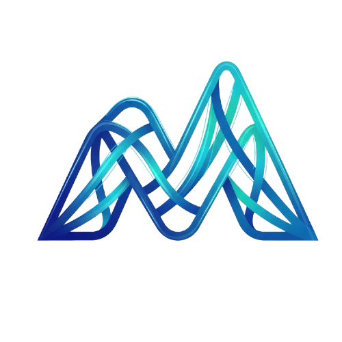

  

# 🩺 MedMentor AI - The Interconnected Medical Brain

> **Vision:** Empowering medical learners through an autonomous, multimodal, and research-first agent ecosystem that turns global knowledge into personalized mastery.

MedMentor AI is a production-grade medical education platform built on a **Hybrid Agent Architecture**. It prioritizes real-time **SOTA Intelligence** (Internet Search + Gemini 3/GPT-5) as its primary knowledge source, using personal documents as a contextual refinement layer.

---

## ✨ Core Pillars

### 1. Research-First Intelligence
Unlike generic RAG apps, MedMentor treats the internet as its primary textbook. Agents perform deep research across verified medical sources (PubMed, Guidelines) before synthesizing answers, ensuring information is current and evidence-based.

### 2. The 14-Agent Swarm (Google ADK)
Powered by **Google ADK (Go)** and **Genkit**, MedMentor utilizes a mesh of specialized agents interacting via the A2A (Agent-to-Agent) protocol:

| Agent Category | Agents |
|:--- | :--- |
| **Orchestration** | **Supervisor** (Routing), **ApiGateway** (Platform Context) |
| **Logic & Pedagogy** | **Tutor** (Socratic), **Socratic** (Stimulated Attending/Pimping) |
| **Knowledge** | **Retrieval** (Web Search/RAG), **Research** (Journal Club/PubMed), **Ingestion** (Doc Parser) |
| **Practice** | **Simulator** (Patient Vitals), **Quiz** (Assessment), **Flashcard** (Anki Gen) |
| **Multimodal** | **Voice** (OSCE/Speech), **Vision** (Radiology/Dermatology) |
| **Success** | **Planner** (Scheduling), **UserProfile** (Adaptive Learning Graph) |
| **Governance** | **Safety** (Policy Enforcement), **Format** (SOAP Notes/Summaries) |

### 3. Enterprise-Ready Architecture
- **Offline-First ("Hospital Mode")**: Critical data (flashcards, notes) syncs via **PowerSync** to a local **SQLite** DB for use in low-connectivity areas.
- **Multiplayer ("Virtual Rounds")**: Real-time collaborative clinical simulations powered by **NATS WebSockets**.
- **Institutional Interop**: Support for **LTI 1.3** and **xAPI** to integrate with University LMSs.

---

## 🏗️ Technical Stack (2026 Standards)

- **Frontend**: Next.js 15, React Native (Expo), Chrome Extension.
- **Agent Mesh**: **Go 1.26+**, **Google ADK**, **NATS JetStream** (A2A Protocol).
- **Cognitive Engine**: **Google Genkit (Go)**, Vertex AI (Gemini 3), OpenRouter, Ollama.
- **Vector Infrastructure**: **Milvus 3.0** (Partitioned Tenant Isolation).
- **Persistence**: **PostgreSQL 18** (Relational), **Dragonfly** (Session Cache), **MinIO** (Global Static Assets).
- **Secrets Management**: **HashiCorp Vault** (Encrypted BYOK storage).

---

## 🚀 Key Features

- **🧠 Socratic Tutoring**: Layered explanations that adapt to your knowledge level.
- **🎙️ OSCE Simulations**: Real-time voice interaction with virtual patients.
- **🩻 Clinical Vision**: Analyze radiology and dermatology cases with VLM-powered agents.
- **📅 Adaptive Planning**: A scheduler that traces your "Knowledge Graph" and builds schedules for USMLE/PLAB based on your weaknesses.
- **🛠️ Agent Studio**: Build and share your own specialized agents for specific medical rotations.

---

## 🛡️ Trust & Safety

MedMentor AI adheres to strict medical safety guardrails:
- **Strictly Educational**: Refuses case-specific diagnosis or treatment for real patients.
- **Evidence Labeling**: Interactive confidence signals and direct citations for every fact.
- **HIPAA Aligned**: End-to-end encryption for all personal study materials and notes.

---

## 📄 License

Proprietary. All rights reserved by **Veera Babu Manyam**.

---
*Developed with ❤️ for the next generation of physicians.*
