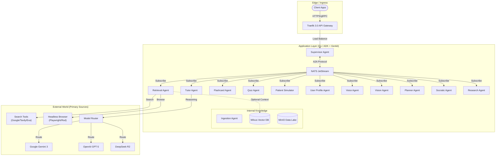
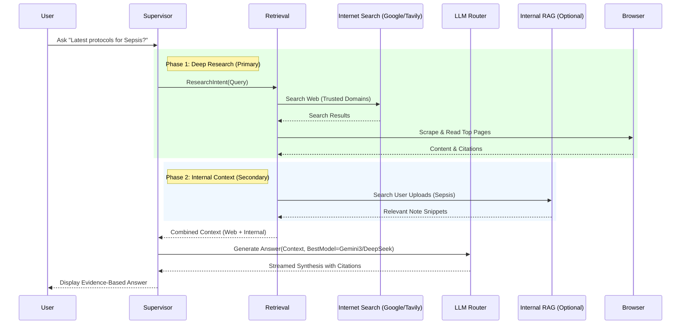
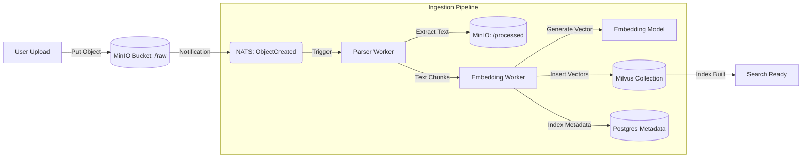
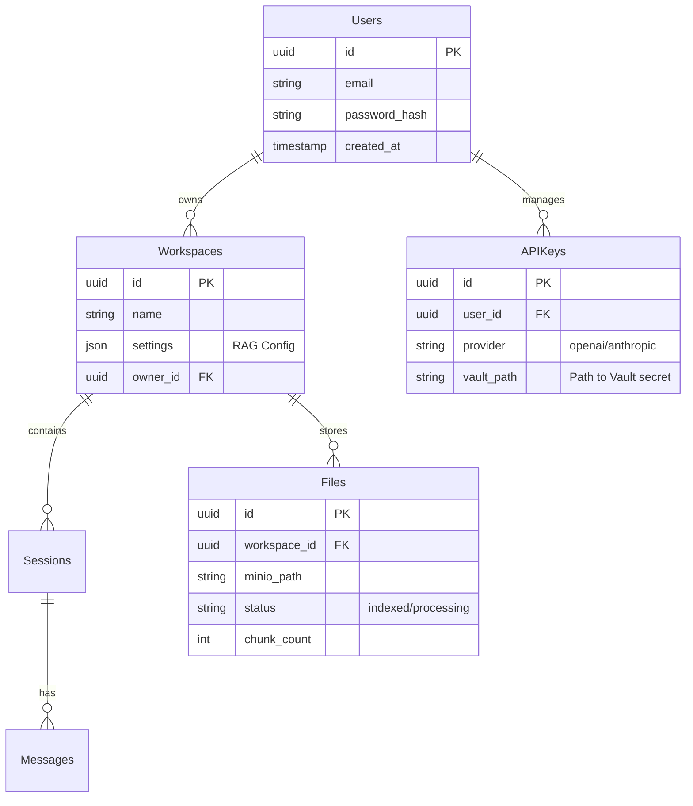
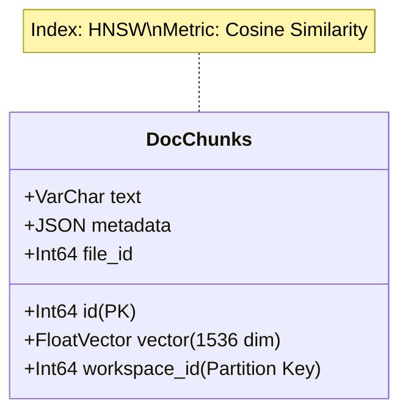

# MedMentor AI — Architecture

**Version:** 0.0.1 (Research-First & Best-of-Breed)
**Status:** Draft
**Last Updated:** 2026-02-19

This document translates the UI/UX system in `docs/DESIGN.md` and the product requirements in `docs/PRD.md` into a concrete software architecture **built on a Research-First philosophy using Google ADK (Agent Mesh) and Google Genkit (Cognitive Engine)**.

## 1. Core Philosophy: Research-First

MedMentor is distinct from traditional RAG apps. It does not predominantly rely on a static internal database.
- **Primary Intelligence Layer**: Real-time **Internet Search** (Google/Tavily) + **SOTA LLMs** (Gemini 3 Pro, GPT-5, DeepSeek R2). The system actively "goes out" to find the latest protocols.
- **Secondary Context Layer**: User uploads (notes, PDFs) stored in **Milvus** provide personalization and grounding, but they are *additive* to the global knowledge base.

## 2. Core Technology Stack

| Component | Technology | Rationale |
| :--- | :--- | :--- |
| **API Gateway** | **Traefik 4.0** | Cloud-native, dynamic configuration, native Kubernetes support. |
| **Runtime** | **Go 1.26+** | High concurrency, low latency, ideal for Agent orchestration. |
| **Agent Orchestration** | **Google ADK (Go)** | First-class Agent primitives, A2A Protocol, Sessions, Tool Registry. |
| **Cognitive Engine** | **Google Genkit (Go)** | LLM Inference, Prompt Management, RAG Flows, Structured Output. |
| **Event Bus** | **NATS JetStream** | High-throughput async messaging for decoupled agents. |
| **Vector Database** | **Milvus 3.0** | Enterprise-grade vector DB for internal user context. |
| **Relational DB** | **PostgreSQL 18** | Metadata, user profiles, structured data. |
| **Object Storage** | **MinIO** | High-performance S3-compatible storage for raw files/datalake. |
| **Model Routing** | **LiteLLM (Go Adapter)** | Unified interface for OpenAI, Anthropic, Gemini, OpenRouter, and Ollama. |
| **Secrets Engine** | **HashiCorp Vault** | Secure storage for User API Keys (BYOK). Encryption at rest. |
| **Observability** | **OpenTelemetry** | Prometheus, Loki, Tempo, Grafana. |

---

## 3. System Context & Infrastructure

### 3.1 High-Level Infrastructure (Research-First)

The architecture explicitly integrates the "External World" as a first-class component.

---

## 4. Application & Agent Architecture

### 4.1 Research-First Knowledge Flow

The decision logic prioritizes external freshness while using internal docs for grounding.

### 4.2 Agent Roles

| Agent | Role | Data Sources |
|-------|------|--------------|
| **Supervisor** | Orchestration, State | NATS, Dragonfly (Session Cache) |
| **Retrieval** | Research & Grounding | **Web Search**, **Headless Browser**, Milvus (Secondary) |
| **Tutor** | Synthesis & Pedagogy | Model Router (LiteLLM: Gemini/OpenRouter/Ollama) |
| **Flashcard** | Active Recall Gen | **Anki Generator**, **Spaced Repetition Algorithms** |
| **Quiz** | Assessment & Scoring | **Question Bank**, **Grading Logic** |
| **Simulator** | Clinical Roleplay | **Persona Engine**, **State Machine** (Patient Vitals) |
| **Format** | Content Transformation | **Markdown/PDF Converters**, **Summarizer** |
| **UserProfile** | Adaptive Learning | **Knowledge Graph** (Postgres), **Knowledge Tracing** (DKT) |
| **Voice** | OSCE / Oral Boards | **Deepgram** (STT), **ElevenLabs** (TTS), **LiveKit** (Transport) |
| **Vision** | Radiology / Derm | **Gemini Vision**, **GPT-4o Vision**, **DICOM Parsers** |
| **Planner** | Study Scheduling | **Calendar API**, **Spaced Repetition Scheduler** |
| **Socratic** | "The Attending" | **Debrief Logic**, **Counter-factual Analysis** |
| **Research** | Journal Club | **PubMed Scanner**, **Paper Summarizer**, **Zotero Integration** |
| **Ingestion** | Document Processing | MinIO (Source), Milvus (Sink) |

---

## 5. Data Flow Architecture (Ingestion Pipeline)

For the secondary internal knowledge layer, we use a scalable ETL pipeline.

## 6. Database Architecture

We use a hybrid data architecture combining relational structured data with vector-based semantic data.

### 6.1 Relational Schema (PostgreSQL)

Handles metadata, authentication, and structured application state.

### 6.2 Vector Schema (Milvus)

Handles high-scale semantic search.

| Collection | Partition Key | Description |
| :--- | :--- | :--- |
| `doc_chunks` | `workspace_id` | Stores all document embeddings. Partitioning ensures strictly isolated tenant search. |

---

## 7. Security & Scalability

- **Sovereignty**: MinIO and Milvus allow full data sovereignty (self-hosted).
- **Bring Your Own Key (BYOK)**:
    - Users can provide their own API keys for **OpenAI**, **Anthropic**, **Gemini**, or **OpenRouter**.
    - Support for local inference via **Ollama** (user provides base URL).
    - Keys are stored in **HashiCorp Vault**, encrypted at rest, and scoped to the user's workspace.
- **Isolation**: Milvus collections partitioned by `workspace_id`.
- **Scaling**: 
    - **Computes**: Go Agents scale horizontally via Kubernetes HPA.
    - **Vectors**: Milvus scales distributed query nodes.
    - **Search**: External search API quotas managed via rate limiters in Traefik/Go.
