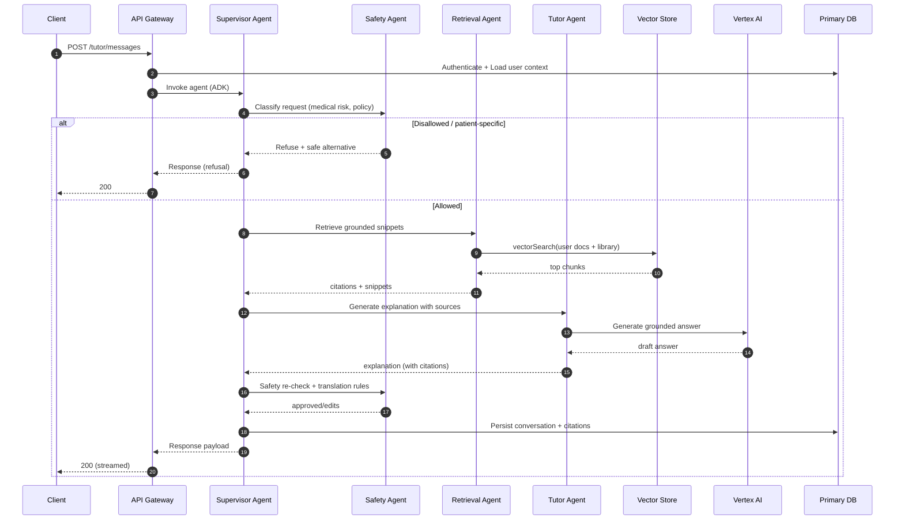
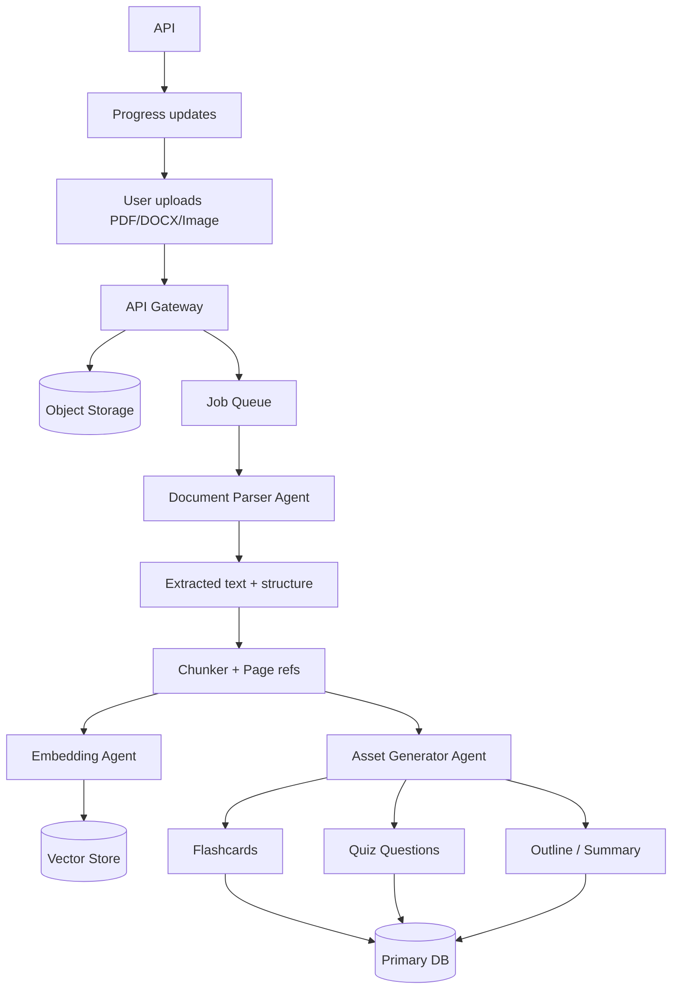

# MedMentor AI — Architecture

**Version:** 0.0.1 (Agent-First Architecture)
**Status:** Draft (implementation-ready)
**Last Updated:** 2026-02-19

This document translates the UI/UX system in `docs/DESIGN.md` and the product requirements in `docs/PRD.md` into a concrete software architecture **built on Google ADK with A2A protocol for AI agent orchestration**.

---

## Architecture Philosophy: Agent-First

MedMentor is built as an **AI agent-driven system from the ground up**. Every backend capability is delivered through specialized AI agents that collaborate using Google's Agent Development Kit (ADK) and the Agent-to-Agent (A2A) protocol.

**Core Shift**: FROM traditional API with AI features → TO AI Agent Orchestrator that coordinates everything

---

## 1) What this covers (and what it doesn't)

### 1.1 Scope (v0.1)
This architecture targets the v0.1 “must have” loop:

- AI Tutor chat (text)
- Content ingestion for user-provided sources (PDF/DOCX/text/images)
- Evidence-linked responses (citations, uncertainty)
- Flashcards + spaced repetition queue
- Quiz builder + explanations + distractor rationales
- Study schedule (calendar-like checklist + auto-reschedule) + ICS export
- Accounts/auth (email + OAuth: Google/Apple/Microsoft), cross-device sync
- Search + organization (tags/folders/filters)
- Notifications (email/push; user configurable)
- Settings (privacy controls, i18n/l10n foundation, export/delete)
- Trust & safety reporting + moderation queue

### 1.2 Explicit non-goals (v0.1)
- Patient-specific diagnosis/treatment or clinical decision support
- Redistributing copyrighted textbooks or proprietary Q-bank content
- Deep two-way calendar sync (write-only integrations are a v0.2 “should”)

---

## 2) Architecture principles

1. **Agent-First**: All backend capabilities delivered through AI agents using Google ADK
2. **Trust is a feature**: retrieval-first grounding, never fabricate citations, conservative uncertainty
3. **Safety-first by default**: refusals for patient-specific guidance; strong policy enforcement via Safety Agent
4. **Privacy-by-design**: data minimization, explicit user controls, tenant/workspace isolation
5. **Mobile-first workflows**: 2–5 minute learning loops; offline-friendly reading later
6. **International-ready**: i18n from day one (externalized strings, RTL readiness, locale-safe time)
7. **Design system as code**: UI tokens (colors/typography/radii) become shared source-of-truth
8. **Ship fast, don’t paint yourself into a corner**: start as a modular monolith + background workers, with clear boundaries for later service extraction
9. **A2A Protocol**: Agent-to-Agent communication enables scalability and modularity

---

## 3) System context (C4 Level 1)

MedMentor is a multi-client application (web + mobile + extension) backed by an **AI Agent Orchestrator** using Google ADK.

```mermaid
flowchart LR
  U[Learner] --> W[Web App]
  U --> M[iOS / Android App]
  U --> X[Browser Extension]

  W --> G[API Gateway<br/>Auth + Rate Limit]
  M --> G
  X --> G

  G --> AO[ADK Agent Orchestrator]

  subgraph Agents["Google ADK Agent Layer"]
    AO --> SUP[Supervisor Agent]

    SUP --> TUT[Tutor Agent]
    SUP --> QUI[Quiz Agent]
    SUP --> FLA[Flashcard Agent]
    SUP --> RET[Retrieval Agent]
    SUP --> SCH[Scheduler Agent]

    TUT --> SAF[Safety Agent]
    QUI --> SAF
    FLA --> SAF
    RET --> SAF
    SCH --> SAF

    SUP --> ANA[|A2A|<br/>Analytics Agent]
    SUP --> MOD[Moderation Agent]
  end

  subgraph Tools["ADK Tool Layer"]
    TUT --> LLM[Vertex AI / LLM Router]
    RET --> VEC[Vector Search]
    RET --> CIT[Citation Tools]
    SCH --> CAL[Calendar API]
    MOD --> REP[Reporting Tools]
  end

  subgraph Storage
    VEC --> DB[(PostgreSQL +<br/>pgvector)]
    LLM --> OBJ[(Object Storage)]
    SAF --> POL[(Policy Store)]
  end

  subgraph Optional["Optional A2A Remote Agents"]
    ANA -.->|A2A| REM1[(Analytics Server)]
    SCH -.->|A2A| REM2[(Scheduler Server)]
  end

  G --> AUT[Auth & Identity<br/>Google/Apple/Microsoft]
  G --> BIL[Billing & Entitlements]
```

**Key Architectural Notes**
- **All user requests flow through the Supervisor Agent** which routes to specialist agents
- **Safety Agent validates ALL outputs** before returning to users
- **A2A Protocol** enables agents to run on separate servers for scalability
- **ADK Tools** provide standardized interfaces to databases, APIs, and external services
- **MCP Support** (optional) for extending tool ecosystem

---

## 4) ADK Agent Architecture (Core)

### 4.1 Agent Definitions

All agents are implemented using **Google ADK** with the following structure:

```python
# Example ADK Agent Pattern
from google.adk.agents import LlmAgent

tutor_agent = LlmAgent(
    name="TutorAgent",
    instruction="""You are a medical education tutor using the Socratic method.
    Provide layered explanations: Simple → Student → Clinical depth levels.
    Always cite sources and admit uncertainty when evidence is weak.""",
    tools=[citation_tool, search_tool, explanation_depth_tool],
    output_key="explanation"
)
```

#### 4.1.1 Supervisor Agent (Central Orchestrator)

**Role**: Routes all user requests to appropriate specialist agents

**Capabilities**:
- Intent classification (Tutor, Quiz, Flashcard, Schedule, Search)
- Agent handoff coordination
- Session state management
- Response aggregation
- Error recovery and fallback

**Tools**:
- `transfer_to_agent`: A2A protocol for remote agent delegation
- `classify_intent`: Route user requests
- `aggregate_response`: Combine multi-agent outputs

**Flow**:
```
User Request → Supervisor → Intent Classification
    → Specialist Agent(s) → Safety Agent → Response
```

#### 4.1.2 Specialist Agents

| Agent | Role | Instruction Focus | Tools | Output |
|-------|------|-------------------|-------|--------|
| **Tutor** | Explanations, teaching | Socratic method, layered depth | Citation, Search, Depth | `explanation` |
| **Retrieval** | RAG, citations | Source verification, grounding | Vector search, Citation, Parse | `citations` |
| **Quiz** | Questions, rationales | Distractor quality, explanations | Template, Content DB, Bloom | `quiz` |
| **Flashcard** | Cards, SRS data | Testability, deduplication | Content DB, SRS algo | `flashcards` |
| **Safety** | Policy enforcement | Refusals, redactions | Policy check, Moderation | `validated_output` |
| **Scheduler** | Study planning | Adaptive rescheduling, burnout protection | Calendar, Progress, Tasks | `schedule` |
| **Analytics** | Progress tracking | Insights, recommendations | Progress DB, ML models | `insights` |
| **Moderation** | Content review | Quality, safety checks | Policy DB, Report tools | `moderation_result` |

#### 4.1.3 A2A Remote Agents (Optional Scaling)

For scalability, deploy agents on separate servers using A2A protocol:

```python
# Remote Agent (on separate server)
analytics_agent = RemoteAgent(
    name="AnalyticsAgent",
    endpoint="https://analytics.medmentor.com/a2a",
    auth_token=env.A2A_AUTH_TOKEN
)

# Supervisor can delegate via A2A
supervisor_agent.tools.append(
    transfer_to_agent_tool(
        agent_name="AnalyticsAgent",
        endpoint="https://analytics.medmentor.com/a2a"
    )
)
```

**Benefits**:
- Horizontal scaling: Deploy multiple instances of high-demand agents
- Independent deployment: Update agents without full system restart
- Language flexibility: Mix Python, TypeScript, Java, Go agents
- Resource isolation: Heavy agents (e.g., Analytics) on dedicated servers

### 4.2 Agent Communication Patterns

#### 4.2.1 Sequential Pattern
```
User → Supervisor → Retrieval → Safety → Response
```

#### 4.2.2 Parallel Pattern
```
User → Supervisor → [Quiz, Flashcard] → Safety → Response
```

#### 4.2.3 Hierarchical Pattern
```
User → Supervisor
    → [Specialist Agents]
    → Safety (all paths converge)
    → Response
```

#### 4.2.4 A2A Remote Pattern
```
User → Supervisor → transfer_to_agent → Remote Agent → Response
```

### 4.3 State Management

ADK session state stores:
- User conversation history
- Agent handoff context
- Retrieved citations and sources
- Quiz/flashcard generation progress
- User preferences (language, depth, etc.)

```python
# State is passed between agents
state = {
    "user_id": "123",
    "conversation_id": "abc",
    "messages": [...],
    "citations": [...],  # From Retrieval Agent
    "explanation": "...",  # From Tutor Agent
    "safety_check": "passed"  # From Safety Agent
}
```

### 4.4 Tool Layer (ADK Tools)

All external access goes through ADK tools:

```python
# Tool definition pattern
from google.adk.tools import Tool

vector_search_tool = Tool(
    name="vector_search",
    description="Search user documents and knowledge library",
    function=vector_search_function,
    parameters={
        "query": "string",
        "limit": "integer (default 5)"
    }
)
```

**Core Tools**:
- **Vertex AI Tool**: LLM model access (Gemini, with multi-provider fallback via LiteLLM)
- **Vector Search Tool**: RAG retrieval from user uploads + knowledge library
- **Citation Tool**: Source linking and verification
- **Database Tool**: CRUD operations for PostgreSQL
- **Calendar Tool**: ICS export, Google Calendar integration
- **File Storage Tool**: Upload/download to Cloudflare R2 or Cloud Storage
- **Search Tool**: Global search across content
- **Policy Tool**: Safety rule checking

**Optional MCP Tools**:
- MCP server integrations for third-party tools
- Allows community tool contributions
- Extensibility without core changes

---

## 5) Client Applications & API Gateway

### 5.1 Client applications
- **Web**: primary product surface for deep study (uploads, reviewing, dashboards).
- **Mobile**: primary surface for spaced repetition + daily checklist loops.
- **Browser extension** (v0.2+): term highlighting + "selected-text-only" sends.

### 5.2 API Gateway (Lightweight)

The API Gateway is minimal - primarily handles auth and routing to ADK agents:

**Responsibilities**:
- Authentication (JWT verification, OAuth)
- Rate limiting (Redis-backed)
- Request routing to ADK Agent Orchestrator
- Response streaming (for real-time agent responses)
- Error handling and fallback

**Technology**:
- Python: FastAPI
- TypeScript/Node.js: Express
- Routes: `/v1/agent/*` (all requests go to agent layer)

**Example Flow**:
```typescript
// API Gateway routes to ADK
app.post('/v1/tutor/messages', async (req, res) => {
  const user = await authenticateUser(req);
  const response = await adkOrchestrator.invoke({
    agent: 'SupervisorAgent',
    input: req.body.message,
    user_id: user.id,
    context: req.body.context
  });
  return streamResponse(res, response);
});
```

### 5.3 Background processing (Agent Workers)

Background tasks are also handled by specialized agents:

**Processing Agents**:
- **Document Parser Agent**: OCR, chunking, metadata extraction
- **Embedding Agent**: Vector embeddings and indexing
- **Quiz Generator Agent**: Bulk quiz generation (async)
- **Flashcard Generator Agent**: Bulk flashcard creation (async)
- **Schedule Agent**: Nightly schedule recomputation
- **Notification Agent**: Email/push notification fanout
- **Eval Agent**: Offline evaluation runs

**Queue**: Redis (Celery for Python, BullMQ for Node.js)

### 5.4 API surface & contracts (v0.1)

Keep the public API stable and boring. Prefer:

- resource-oriented endpoints (REST-style)
- explicit versioning (`/v1/...`)
- idempotency keys for write endpoints that can be retried
- consistent error envelopes (machine-readable `code`, human `message`)

Suggested endpoint groups:

- **Auth**: `/v1/auth/*` (email login, OAuth connect/disconnect, sessions)
- **Profile/Prefs**: `/v1/me`, `/v1/me/preferences` (language, locale, timezone, bilingual mode)
- **Library**: `/v1/library/documents`, `/v1/library/documents/{id}/status`, `/v1/library/documents/{id}/exports`
- **Tutor**: `/v1/tutor/messages` (streaming optional), `/v1/tutor/conversations/{id}`
- **Flashcards/SRS**: `/v1/decks`, `/v1/flashcards`, `/v1/reviews/queue`, `/v1/reviews/{cardId}`
- **Quizzes**: `/v1/quizzes`, `/v1/quizzes/{id}/attempts`, `/v1/questions/{id}`
- **Mistake Notebook**: `/v1/mistakes`, `/v1/mistakes/{id}`
- **Schedule**: `/v1/tasks`, `/v1/tasks/{id}`, `/v1/calendar/ics` (export)
- **Search**: `/v1/search?q=...&filters=...`
- **Reports/Moderation (user-facing)**: `/v1/reports` (unsafe/incorrect/IP)
- **Billing**: `/v1/billing/subscription`, `/v1/billing/entitlements`, `/v1/billing/usage`

Response conventions to standardize early:

- All timestamps are UTC in the API; clients render in the user’s preferred IANA time zone.
- Language tags use BCP-47.
- Any AI-generated payload with citations includes:
  - `citations[]`
  - `evidence_strength` (qualitative)
  - `source_mode` (e.g., `grounded`, `from_user_notes_only`, `uncited`)

---

## 5) UI architecture (design-system-driven)

`docs/DESIGN.md` defines the visual system (glassmorphism, tokens, motion, WCAG). Implementation should ensure **design parity across web and mobile**.

### 5.1 Design tokens
- Store canonical tokens as machine-readable artifacts (e.g., `tokens.json` → CSS variables + mobile theme maps).
- Maintain:
  - **Light theme** tokens (`:root[data-theme='light']`)
  - **Glass/Dark theme** tokens (`:root` glass variables)

### 5.2 Component library
- Build a shared component library that bakes in:
  - 4px spacing grid
  - 44×44 minimum hit targets
  - focus rings + keyboard navigation
  - `prefers-reduced-motion`

### 5.3 Glassmorphism performance constraints
- `backdrop-filter` is GPU-expensive; apply only to key surfaces (cards, nav, sheets).
- Provide fallbacks for browsers/devices where blur is degraded:
  - increase opacity on the glass background
  - reduce blur radius

### 5.4 Internationalization (i18n) + RTL readiness
From the PRD’s i18n requirements, the client architecture should include:

- **Externalized strings** with stable keys and a localization pipeline.
- **Plural rules and formatting** using ICU MessageFormat (or an equivalent that supports plural/gender).
- **Locale-aware formatting** for:
  - dates/times (including week start day)
  - numbers/percentages
- **RTL support** (Arabic Tier 1):
  - bidi-safe layouts
  - mirrored icons where appropriate
  - RTL-safe text fields/cursor behavior
- **Bilingual safety mode** for non-English:
  - UI toggle to show English alongside translated AI outputs
  - explicit “translated” labels on AI outputs when applicable

---

## 6) Data architecture

### 6.1 Primary storage
- **Relational DB** (recommended): users, content metadata, schedules, attempts, billing state.
- **Object storage**: raw uploads (PDF/DOCX/images), extracted text artifacts, generated media.
- **Vector store**: embeddings for user uploads + (later) MedMentor Knowledge Library.
- **Cache**: session cache, RAG results cache, entitlement cache.

### 6.2 Core entities (conceptual)

- `User`
- `Workspace` (personal by default; supports cohort/institution later)
- `UserPreferences` (language, locale, timezone, “keep medical terms in English”, bilingual toggle)
- `UploadDocument` (metadata + ownership + attestation)
- `DocumentChunk` (page refs + offsets + hash)
- `Embedding` (vector + chunk reference)
- `Flashcard` (type: basic/cloze/occlusion; language metadata)
- `Deck` (taggable; share controls later)
- `ReviewState` (SRS scheduling data per card per user)
- `Quiz` / `Question` / `Attempt`
- `MistakeEntry` (missed question, misconception, linked remediation)
- `StudyTask` (scheduled work item)
- `NotificationPreference` + `NotificationEvent`
- `Subscription` + `Entitlement` + `UsageMeterEvent`
- `Report` (unsafe/incorrect/IP) + `ModerationAction`
- `AuditLog`

### 6.3 Multi-language fields
For learner-facing content, store:

- `content_language` (BCP-47 tag, e.g., `en`, `es-419`, `ar`)
- `canonical_term_language` (often English)
- optional `bilingual_pair_id` linking (English ↔ translated)

---

## 7) UI architecture (design-system-driven)

`docs/DESIGN.md` defines the visual system (glassmorphism, tokens, motion, WCAG). Implementation should ensure **design parity across web and mobile**.

### 7.1 Design tokens
- Store canonical tokens as machine-readable artifacts (e.g., `tokens.json` → CSS variables + mobile theme maps).
- Maintain:
  - **Light theme** tokens (`:root[data-theme='light']`)
  - **Glass/Dark theme** tokens (`:root` glass variables)

### 7.2 Component library
- Build a shared component library that bakes in:
  - 4px spacing grid
  - 44×44 minimum hit targets
  - focus rings + keyboard navigation
  - `prefers-reduced-motion`

### 7.3 Glassmorphism performance constraints
- `backdrop-filter` is GPU-expensive; apply only to key surfaces (cards, nav, sheets).
- Provide fallbacks for browsers/devices where blur is degraded:
  - increase opacity on the glass background
  - reduce blur radius

### 7.4 Internationalization (i18n) + RTL readiness
From the PRD's i18n requirements, the client architecture should include:

- **Externalized strings** with stable keys and a localization pipeline.
- **Plural rules and formatting** using ICU MessageFormat (or an equivalent that supports plural/gender).
- **Locale-aware formatting** for:
  - dates/times (including week start day)
  - numbers/percentages
- **RTL support** (Arabic Tier 1):
  - bidi-safe layouts
  - mirrored icons where appropriate
  - RTL-safe text fields/cursor behavior
- **Bilingual safety mode** for non-English:
  - UI toggle to show English alongside translated AI outputs
  - explicit "translated" labels on AI outputs when applicable

---

## 8) Data architecture

### 8.1 Primary storage
- **Relational DB** (PostgreSQL recommended): users, content metadata, schedules, attempts, billing state
- **pgvector extension**: Vector embeddings in the same database
- **Object storage**: raw uploads (PDF/DOCX/images), extracted text artifacts, generated media
- **Cache**: Redis for session cache, RAG results cache, entitlement cache

### 8.2 Core entities (conceptual)
- `User`
- `Workspace` (personal by default; supports cohort/institution later)
- `UserPreferences` (language, locale, timezone, "keep medical terms in English", bilingual toggle)
- `AgentConfig` (user-created agents from Agent Studio)
- `UploadDocument` (metadata + ownership + attestation)
- `DocumentChunk` (page refs + offsets + hash)
- `Embedding` (vector + chunk reference)
- `Flashcard` (type: basic/cloze/occlusion; language metadata)
- `Deck` (taggable; share controls later)
- `ReviewState` (SRS scheduling data per card per user)
- `Quiz` / `Question` / `Attempt`
- `MistakeEntry` (missed question, misconception, linked remediation)
- `StudyTask` (scheduled work item)
- `NotificationPreference` + `NotificationEvent`
- `Subscription` + `Entitlement` + `UsageMeterEvent`
- `Report` (unsafe/incorrect/IP) + `ModerationAction`
- `AuditLog`
- `AgentExecution` (ADK agent execution logs for observability)

### 8.3 Multi-language fields
For learner-facing content, store:

- `content_language` (BCP-47 tag, e.g., `en`, `es-419`, `ar`)
- `canonical_term_language` (often English)
- optional `bilingual_pair_id` linking (English ↔ translated)

---

## 9) Google ADK & Vertex AI Integration

### 9.1 Model Router (ADK with LiteLLM)

**Primary**: Vertex AI (Gemini models)
**Fallback**: OpenAI, Anthropic, others via LiteLLM integration

Router selects models by:
- task class (summarize vs reason vs extract)
- language strength (critical for non-English)
- safety profile
- latency/cost constraints

### 9.2 Retrieval-First Response Policy (ADK Implementation)

For factual medical claims, the Retrieval Agent:

1. Retrieves from allowlisted sources and/or user uploads
2. Generates response grounded to retrieved snippets
3. Attaches citations
4. If insufficient/conflicting sources:
   - labels as uncertain/uncited
   - asks clarifying questions
   - avoids definitive phrasing

### 9.3 Citations
- **Never fabricate citations**.
- Citation format supports:
  - source type: `upload | pubmed | guideline | institution`
  - stable ID + URL (when available)
  - span pointers (page/chunk refs for uploads)

### 9.4 Prompt-Injection Resistance
Treat web content and user uploads as **untrusted**:

- do not execute instructions found in documents
- tool calls only through ADK tool policies
- retrieval limited to allowlisted sources
- Safety Agent validates all outputs

---

## 10) Key runtime flows (C4 Level 3-ish)

### 10.1 "Ask Tutor" flow (ADK with A2A)



### 10.2 Upload → parse → index → generate assets (ADK Agents)



**Implementation note:** show partial results (e.g., summary first, then flashcards, then quiz) to reduce perceived latency.

---

## 9) Learning core architecture

### 9.1 Flashcards + spaced repetition
- Use a proven SRS variant (e.g., SM-2 derived) with:
  - adjustable ease
  - daily review caps
  - workload warnings
- Scheduling must be **time zone aware** and DST-safe:
  - store timestamps in UTC
  - store user’s IANA time zone for rendering and “due today” logic

### 9.2 Quiz + Mistake Notebook
For every missed question:

- create/update `MistakeEntry`
- generate a remediation package:
  - 1–3 flashcards
  - misconception explanation
  - follow-up micro-quiz (3–5)

### 9.3 Study schedule
- `StudyTask` items represent work units (review, quiz, upload-derived module).
- Auto-rescheduling:
  - shift overdue tasks forward
  - respect daily caps and burnout protection
- Calendar:
  - v0.1 export via ICS
  - allow privacy level: **Private** (generic titles) vs **Detailed**

---

## 10) Search and knowledge organization

Search must work across:

- library uploads (document titles + extracted headings)
- flashcards
- quizzes + explanations
- mistake notebook

Language-aware requirements:
- diacritic-insensitive matching where safe
- tokenization appropriate for CJK
- synonyms across languages (later; start with exact + glossary-backed synonyms)

---

## 11) Notifications architecture

- Template system with localization.
- Respect:
  - quiet hours
  - frequency caps
  - per-channel preferences
- Event sources:
  - reviews due
  - tasks scheduled
  - streak protection

---

## 12) Billing, entitlements, and quotas

Architecture must support:

- subscription state per user/workspace
- entitlement checks on:
  - uploads/pages processed
  - questions generated
  - image mnemonic generations
  - vector storage usage
- metering events emitted by workers and API
- “graceful paywalling” (no data loss)

---

## 13) Security, privacy, and compliance

### 13.1 Authentication & session security
- OAuth with PKCE where applicable.
- Secure token storage on mobile (Keychain/Keystore) and web (httpOnly cookies preferred).
- Account switching on device must guarantee **no cross-account data leakage**.

### 13.2 Authorization
- RBAC (user/support/reviewer/admin).
- Workspace isolation (personal now; cohort/institution later).

### 13.3 Data protection
- TLS in transit; encryption at rest.
- Secrets managed via a secrets manager.
- Audit logs for admin/reviewer actions.

### 13.4 IP and content governance
- Upload attestation (“I have rights to upload”).
- No public sharing by default.
- Report + takedown workflows.

### 13.5 User rights
- Export (machine-readable).
- Delete account + derived artifacts (embeddings/vector entries) where feasible.
- Document retention windows for backups.

### 13.6 Moderation, review, and auditability
v0.1 must support a lightweight but real review loop:

- **User reports**: incorrect / unsafe / IP violation.
- **Moderation queue** (internal):
  - triage status (new → investigating → resolved)
  - severity labeling (P0–P3)
  - assignment + SLA tracking
- **Reviewer tooling** should display “why the model said this”:
  - retrieved snippets used
  - citations selected
  - evidence-strength label rationale
- **Immutable audit logs** for:
  - reviewer edits/actions
  - admin account changes
  - data export/deletion requests

---

## 14) Safety architecture (medical + AI)

### 14.1 Policy engine
- Enforce “educational only” use.
- Refuse patient-specific diagnosis/treatment and emergency guidance.
- Provide safe alternatives (general explanation, guideline summary, encourage professional help).

### 14.2 Evidence strength / confidence labeling
- Prefer qualitative levels (High/Medium/Low).
- Include a “Why this confidence?” panel sourced from:
  - citation presence/quality
  - agreement across sources
  - whether derived only from user uploads (“From your notes”)

### 14.3 Evaluations and release gates
Align to PRD §6.4:

- citation presence and correctness
- factuality
- refusal correctness
- prompt injection resilience
- “high-confidence wrong” sentinel

### 14.4 Human-in-the-loop quality program (MVP)
Operationalizing trust requires recurring human review:

- 24–48h triage SLA for user-reported unsafe/incorrect items (as described in the PRD)
- weekly sampling audits for high-risk topics and top-used flows
- reviewer outcomes feed:
  - prompt updates
  - retrieval/source allowlist updates
  - targeted evaluation cases

---

## 15) Observability and operations

### 15.1 Telemetry
- Standard: logs/metrics/traces.
- AI-specific:
  - citation coverage
  - refusal rate
  - user reports (unsafe/incorrect/IP)
  - latency by pipeline stage (retrieve → generate → post-check)

### 15.2 Rollout strategy
- Feature flags for:
  - model routing changes
  - new prompts
  - new retrieval sources
- Canary + monitoring + rollback runbook.

---

## 16) Deployment (implementation options)

This document is cloud-agnostic; a practical v0.1 path is:

- **API server** (containerized)
- **Worker(s)** (containerized)
- **Managed DB** (Postgres recommended)
- **Managed object storage**
- **Managed queue**
- **Managed vector store**

As load grows:
- split AI Orchestrator and ingestion workers into independent scaling units
- introduce dedicated search service if needed

---

## 17) Appendix — design system implications for engineering

From `docs/DESIGN.md`:

- WCAG 2.2 AA is non-negotiable (focus rings, contrast, 44px touch targets).
- Motion must respect `prefers-reduced-motion`.
- Glassmorphism requires:
  - careful performance profiling
  - Safari prefixes (`-webkit-backdrop-filter`)
  - fallback styles

---

## 18) Open decisions (track explicitly)

1. **Client stack**: React Native vs Flutter vs native; and Web stack (e.g., Next.js).
2. **Vector store choice**: managed vs self-hosted; per-tenant isolation strategy.
3. **Search indexing**: DB full-text vs dedicated search engine.
4. **Payments**: Stripe-only for web vs full app-store billing integration.
5. **Multi-tenant B2B**: timeline for strict tenant data residency.
